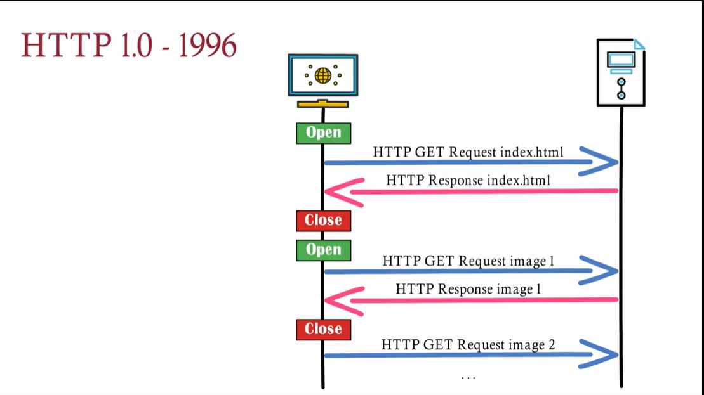
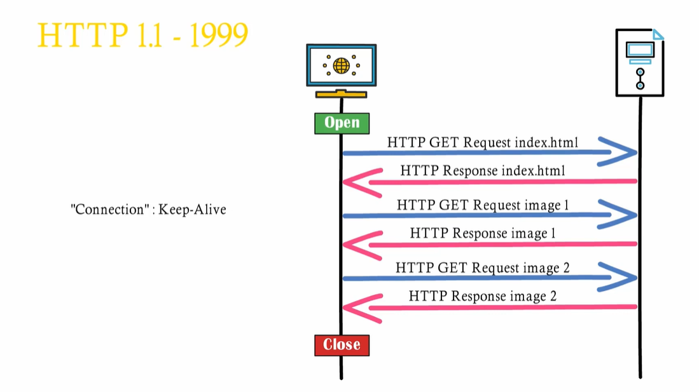
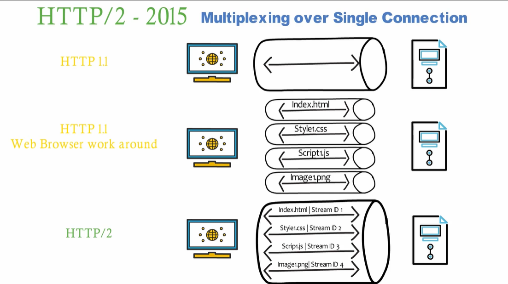
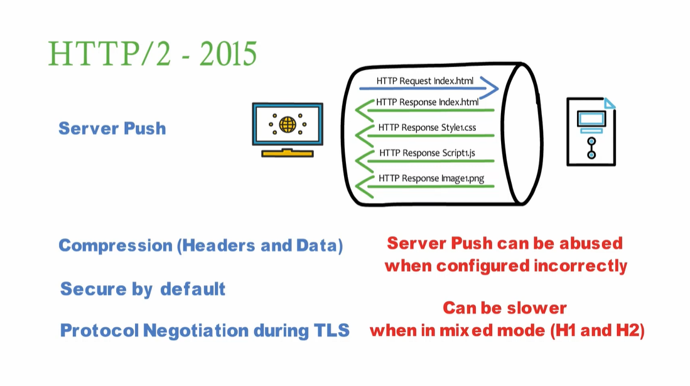
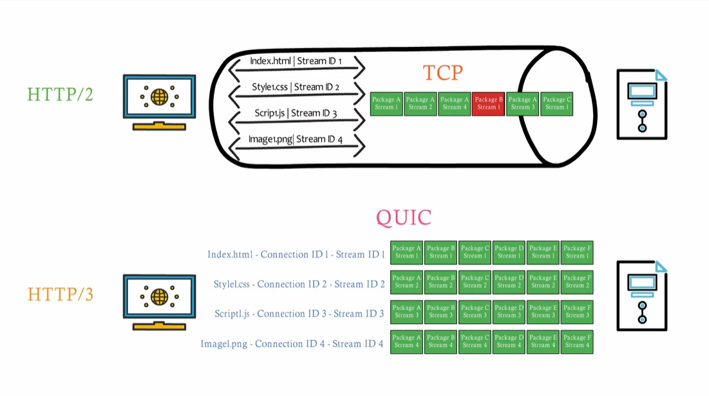
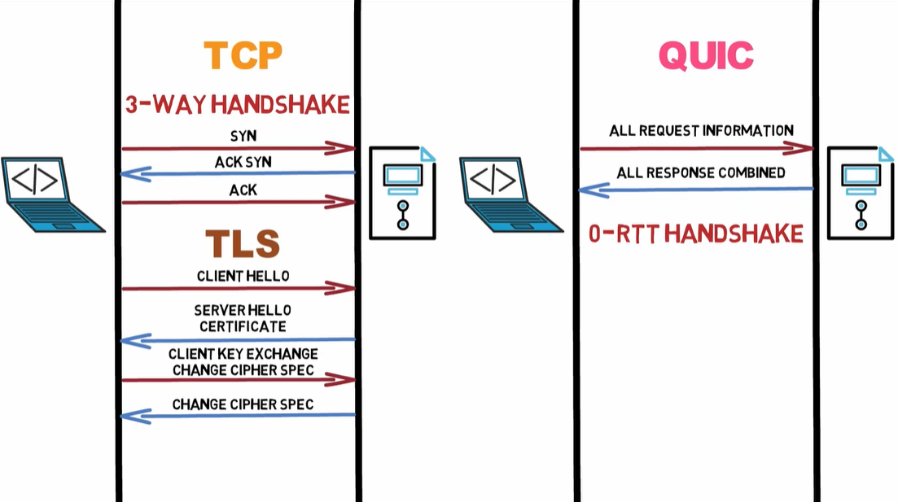
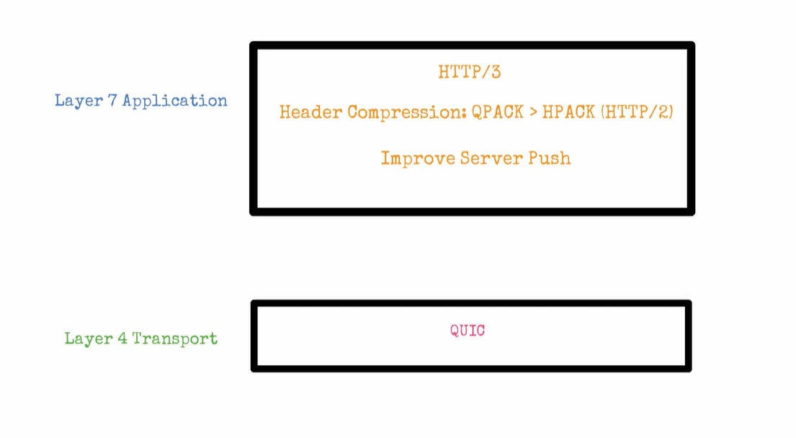

# Backend-Engineer---Base

## OSI model
- send out:
```
Layer 7 Application: Get/10.0.0.3 80, HTTP Header, Cookies, Content-Type,...
```
```
Layer 6 Presentation: Encrypt if necessary (https)
```
```
Layer 5 Session: Establish session tag it
```
```
Layer 4 Transport: break into segment, add ports/seq
```
```
Layer 3 Network: get into segment in Layer 4 and add to destination ip (use dns)
```
```
Layer 2 Data Link: get MAC address (use ARP) and add to segment
```
```
Layer 1 Physical: convert segment -> bit (01) and transport ->>>>
```
->> When the signal is sent, all computers in the network can catch the packet you send

- receive:
```
Layer 1 Physical: receive bit in the networks
```
```
Layer 2 Data Link: convert bit -> segment if same MAC address
```
```
Layer 3 Network: get ip address in segment and compare with your device 
```
```
Layer 4 Transport: Verify port/seq resend error packets
```
```
Layer 5: Session: Collect session ID order
```
```
Layer 6 Presentation: Decrypt if necessary (HTTPS)
```
```
Layer 7 Application: Get/10.0.0.3.80 - HTTP Header, Cookies, Content-Type,...
```

## TCP - Transmission Control Protocol
- Layer 7 Application: HTTP ver1.0 ver1.1 ver2.0 ver3.0(QUIC)
- Layer 4 Transport: TCP

- TCP transport needs to make a connection use (Three-way handshake)
    (Advantages)
    + Acknowledgement : cơ chế báo nhận
    + Guaranteed Delivery : đảm bảo tin cậy
    + Recovery : khôi phục
    + Ordered Package : trật tự các gói tin (khi có nhiều gói tin)
    + Flow Control : kiểm soát luồng
    + Congestion: kiểm soát tắc nghẽn
    + Pipeline : kiểu truyền Pipeline (cùng lúc nhận và cùng lúc thông báo)
    (Defect)
    + Larger Package : gói tin lớn
    + More Bandwidth : tốn băng thông
    + Slower than UDP : chậm hơn UDP
    + Stateful : có trạng thái (khi một trong 2 thiết bị mất kết nối phải làm lại từ đầu)

    (use TCP with)
    HTTP SSH FTP(truyền file) Telnet SMTP IMAP/POP

## UDP - User Datagram Protocol
- Layer 4 Transport: UDP

- Works like TCP but skip the error checking process
- If packets are missed, the sender will not resend

    (Advantages)
    + Small Package : kích thước nhỏ
    + Less Bandwidth : ít băng thông hơn
    + Fasster than TCP : nhanh hơn TCP
    + Stateless : không trạng thái
    (Defect)
    + No Acknowledgement : không cung cấp cơ chế báo nhận
    + No Guaranteed Delivery : không cung cấp cơ chế đảm bảo tin nhắn
    + Connectionless : không duy trì kết nối connectionless
    + No Ordered Package : không đảm bảo thứ tự nhập gói tin
    + No flow control : không cung cấp cơ chế kiểm soát luồng
    + No congestion control : không kiểm soát tắc nghẽn
    + Security : không an ninh :v

    (use TCP with)
    TFTP RTSP SNP DNS
    Streaming Video, Gaming Online

## HTTP - Hyper Text Transfer Protocol
- Layer 7 Application: HTTP ver1.0 ver1.1 ver2.0 ver3.0(QUIC)
- Layer 4 Transport: TCP / QUIC

- Client -> request
- Server -> response

</img>
</img>

## HTTP 1.0 - 1996
</img>

## HTTP 1.1 - 1999
</img>

## HTTP 2.0 - 2015
</img>
</img>

## QUIC - Quick Udp Internet Connections
## HTTP 3.0
</img>
</img>
</img>

## Encryption
</img>

## HTTPS Hyper Text Transfer Protocol Secure
- HTTP + TLS